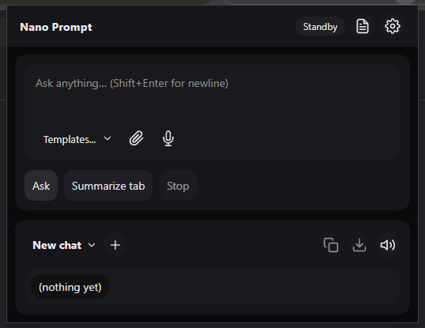

Nano Prompt UI — Chrome MV3 (On-Device AI, Local-Only)

TL;DR: A Chrome extension that runs entirely on-device using Chrome’s Language Model (Gemini Nano) API. No servers, no network calls. This README covers install steps and enabling the on-device model.

1. Files \& Layout (single-folder)
   /nano-prompt-ui/
   context.js
   handlers.js
   manifest.json
   model.js
   popup.css
   popup.html
   popup.js
   storage.js
   ui.js
   utils.js
2. Install (Developer Mode, Unpacked)

Download or clone this repo so all files above are in the same folder (with manifest.json).

Open chrome://extensions.

Toggle Developer mode (top-right).

Click Load unpacked and select the folder (or drag the folder onto the page).

You can’t drag a .zip directly into chrome://extensions. Unzip first and load the folder.

3. Enable On-Device AI (Gemini Nano) in Chrome

Open chrome://flags and enable:

Prompt API for Gemini Nano → chrome://flags/#prompt-api-for-gemini-nano

Optimization Guide On Device Model → chrome://flags/#optimization-guide-on-device-model

(If the API still doesn’t appear on older builds) Experimental Web Platform features → chrome://flags/#enable-experimental-web-platform-features

Click Relaunch when prompted.

Notes

Use a recent Chrome (desktop). If flags aren’t present on Stable, try Beta/Dev/Canary.

Platform support can vary (Windows/macOS are usually first; Linux may lag).

Managed devices may restrict these features by policy.

4. Ensure the model downloads

Open chrome://components.

Find Optimization Guide On Device Model.

Click Check for update.

Wait for a non-zero version and Status: Up-to-date.

If it’s missing or stuck at 0.0:

Re-check flags and relaunch Chrome.

Leave Chrome open—download can be large.

Confirm network access/firewall.

Try a newer Chrome channel.

On managed devices, check chrome://policy.

5. Quick sanity check (DevTools)

Open any https:// page → DevTools Console:

'languageModel' in self.ai

If true, try:

const s = await self.ai.languageModel.create();
(await s.prompt('Say hello in five words.')).trim();

A short string back = on-device model is working.

6. Using the Extension

Open the popup from the toolbar.

Ask: type and press Enter.

Summarize Tab: reads visible text on the current tab and returns 5 concise bullets.

Language: choose EN/ES/JA.

Location (optional): if permitted, a simple “Location:” string can be attached to prompts.

The extension runs locally via self.ai.languageModel and makes no network calls.

7. Permissions

storage — local settings/history

scripting, activeTab — read page text for summarization

clipboardWrite — copy responses

(Optional) geolocation — only if you opt in

8. Troubleshooting

“Model unavailable”

Ensure flags are enabled \& Chrome was relaunched.

Check Optimization Guide On Device Model in chrome://components has a version.

In DevTools:

'languageModel' in self.ai

If false, update Chrome or try Beta/Dev/Canary.

“No readable text found on this tab.”

Some pages (canvas/webgl/Chrome-internal like chrome://) aren’t readable. Try a standard https:// page.

Popup shows “fallback”

If a popup session can’t open, it tries an in-page session. This requires a normal web page and may still fail if the page blocks script execution.

Enterprise/school devices

Policies may block the model or API. See chrome://policy.

Linux

Support may lag; use an up-to-date Chrome and verify the component download.

9. Roadmap / Notes

* Chat UX: persistent multi-turn conversations with tabbed sessions; Markdown/code rendering; voice in/out; quick export \& prompt templates with simple feedback.
* Smarter context: readable article/main-content extraction + metadata, plus a context viewer with editable overrides before sending.
* Nano integration: streaming replies, (early) image/audio input, availability/download progress \& graceful fallbacks, with performance guards for low-end devices.
* Reliability \& control: cancel/stop, retry with trimmed context, keyboard shortcuts \& auto-growing input; session persistence, optional sync, and searchable/tagged history.
  

10. License

The Unlicense — see LICENSE.

11. Credits

Built by Vimal "Vibe Coded" with ai.

